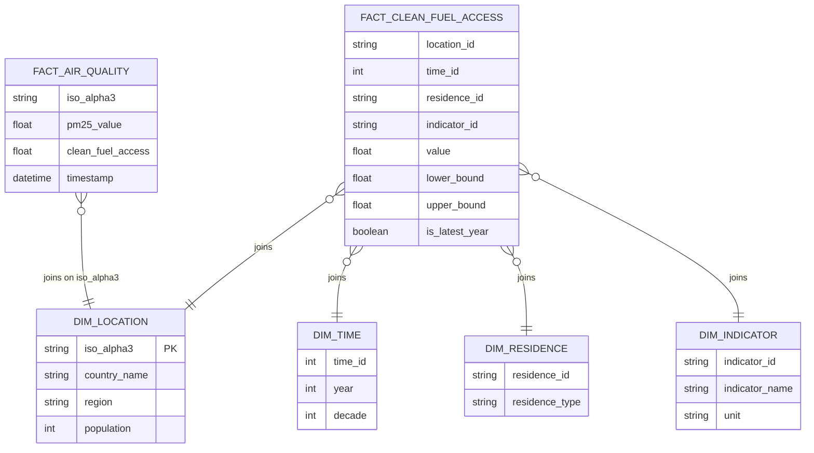
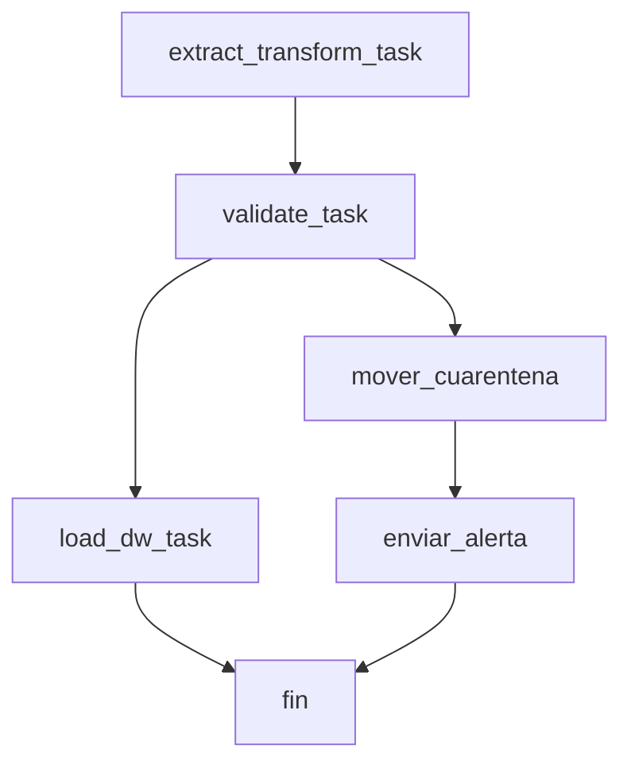

# etl-project-second-delivery
check first delivery link: https://github.com/juandavidmeza-prog/etl-project-first-delivery/tree/main

## Team Members
$$
\begin{array}{|c|c|}
\hline
\text{Código} & \text{Apellido} & \text{Nombre}\\
\hline
\text {2240129}  & \text {Meza}  & \text {Juan David} \\
\text {2243533}  & \text {Uribe}  & \text {Santiago}  \\
\text {2249266}  & \text {Zambrano}  & \text {Andrés}  \\
\hline
\end{array}
$$

## Libraries
The project was designed to run on the Google Colab environment. While this poses some limitations to the scope and availability of the notebook and its dependencies, the pros outweighted the cons. Namely, the guarantee that it would run under the preset configuration for every team member or evaluator, as well as the comfort of an option that was already tried and tested along the course's activities. 

Even though no dependencies are to be installed locally, the notebook does ask for a few imports. Their names and roles are as presented: 

* Pandas: dataframe management, EDA, plotly, and `.csv` to `.db` intermediary.  
* SQLite3: python + SQL. Replaced DuckDB as per the Airflow setup provided during the course.  
* plotly: most competent way of integrating a dashboard visualization into Google Colab.
* Airflow and Great Expectations: orchestrator and data quality validator for the pipeline, respectively, in accordance to the expected scope of the project. Worth noting, their use and implementation is identical to the `airflow_gx.ipynb` example displayed during class.  
* Requests: handling OpenAQ and REST Countries respective API calls.  
* json: API responses handling commodity, as they are sent in `.json` format, meaning the tailored library is rather suitable.  
* os, datetime: emotional support.  

## Technologies 
### Data Warehouse Architecture 
Succeeding the previous submission, the team focused on expanding the scope of information the warehouse could provide. To this extent, it was decided OpenAQ would fit the job, as it offers valuable, real, and updated insights on the different countries' air conditions (when the API responses work, that is). Given standarized nomenclature is a top priority, the third source that should also guarantee coherence on this regard, and ideally elaborate on the available information for each data point. [REST Countries](https://restcountries.com/) was ultimately chosen for the task, although scrapping [Wikipedia's ISO 3166-1 page](https://en.wikipedia.org/wiki/ISO_3166-1) (or its variants) was considered for the same end.  

The facts remain the same (not literally though): it is still a star schema, albeit with a new fact table (provided by OpenAQ) and a small addition to the location dimension (REST Countries) --and the relevant join, of course.  

### Airflow DAG design
Once again emulating the course's demonstration, the team designed the DAG such as it ingests the data and then validates it before loading it into the final warehouse. While it could be separated into three different branches (i.e., each source being processed on its own and having the validation apply individually), the team decided it was not the effort given the reliability of the sources: one is unchanging (WHO), one is big enough to pretty much guarantee it will be available 24/7 (REST Countries), and one is a small opensource project with ~~barely a few hundred people network and a distinctive lack of consistency in their API to the point we might as well treat it as nonexistent~~ limited support and interruptions in their service status (OpenAQ). Under this optic, it was deemed more realistic to treat the whole pipeline as a consistent stream that would only significantly break down under abnormal circumstances, and otherwise deprecate the unresponsive parts and either replace them manually or substitute them with a dummy value until a more reliable, consistent solucion is found.   

### Dashboard (click me)

