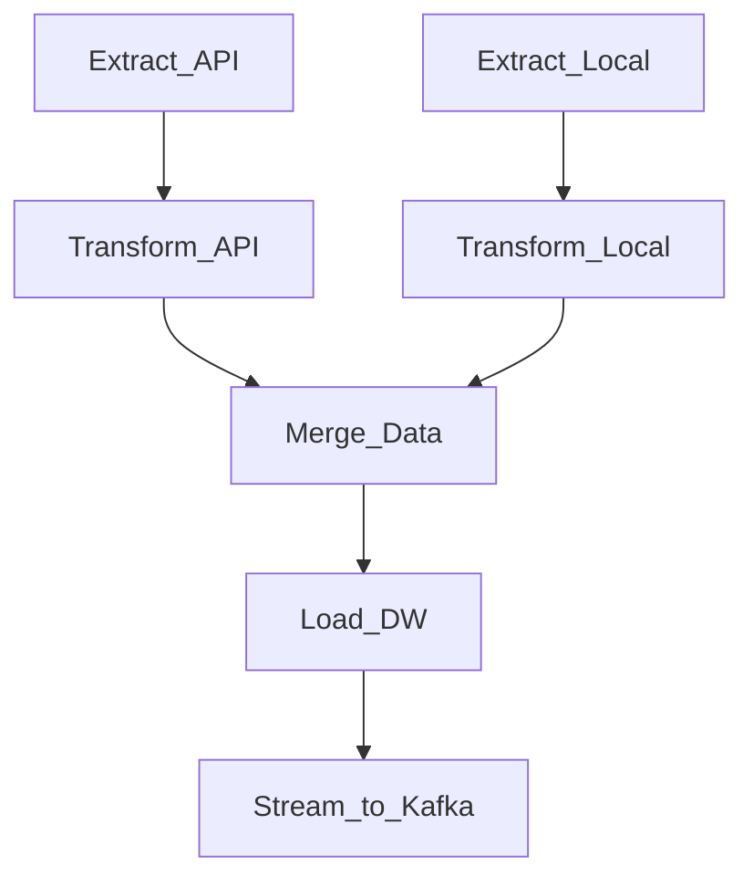
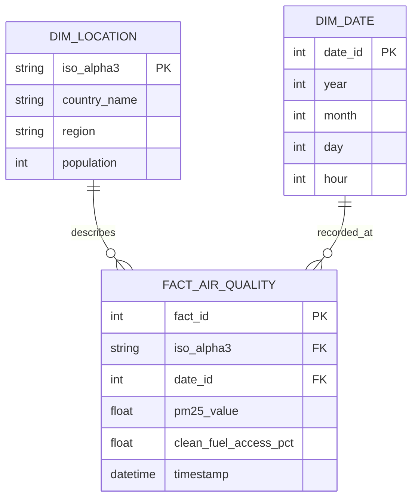
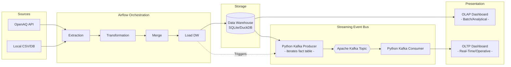

# Data Warehouse & Streaming Pipeline - Blueprint Documentation

Beep boop. This was largely formatted by AI in order to reduce typing errors after previous submissions lead to rapid sanity decay on the team. Most of the work (other than the Kafka bit) is recycled from previous deliveries, so it's fine, probably.  

## 1. Sources and Value Generation Articulation

**Sources to be used:**
1. **API Source:** OpenAQ API (provides real-time air quality metrics, specifically PM2.5).
2. **Local Source:** Local Database/CSV containing WHO Household Air Pollution data (clean fuel access) and demographic data (population, region).

**Value Generation Draft:**
*   **Operative Value:** By streaming the ingested PM2.5 metrics via Kafka, the system provides real-time monitoring capabilities. This allows operational dashboards to display live pollution levels and trigger immediate alerts if hazardous thresholds are crossed, enabling quick reactive measures.
*   **Analytical Value:** By loading merged historical air pollution and demographic data into a dimensional warehouse, the business can perform deep-dive trend analysis. This enables the correlation of clean fuel access with overall air quality, facilitating long-term public health research, regional comparisons, and strategic policy-making.

---

## 2. Airflow DAG Design and Dependencies Tree

**DAG Tasks:**
*   `Extract_API`: Fetches recent air quality data from the OpenAQ API.
*   `Extract_Local`: Reads demographic and clean fuel data from the local database/CSV.
*   `Transform_API`: Cleans API data, filters for PM2.5, and standardizes country codes.
*   `Transform_Local`: Cleans local data, handles missing values, and selects relevant columns.
*   `Merge_Data`: Joins both transformed datasets on the standardized ISO country code.
*   `Load_DW`: Inserts the merged records into the Dimensional Model (Star Schema).
*   `Stream_to_Kafka`: Acts as a Kafka Producer; queries the recently loaded fact data and iterates over the rows, streaming them to a Kafka topic with a slight delay to simulate a real-time event feed.

**Dependencies Tree:**

---

## 3. Dimensional Model

The Data Warehouse will be structured using a **Star Schema** to optimize for analytical queries.

**Fact Table: `fact_air_quality`**
*   `fact_id` (Primary Key)
*   `iso_alpha3` (Foreign Key -> dim_location)
*   `date_id` (Foreign Key -> dim_date)
*   `pm25_value` (Measure)
*   `clean_fuel_access_pct` (Measure)
*   `timestamp` (Measure/Metadata)

**Dimension Table: `dim_location`**
*   `iso_alpha3` (Primary Key)
*   `country_name`
*   `region`
*   `population`

**Dimension Table: `dim_date`**
*   `date_id` (Primary Key - e.g., YYYYMMDD)
*   `year`
*   `month`
*   `day`
*   `hour`

---

## 4. Expected Dashboard Outlooks

**OLAP Dashboard (Analytical - Pulling from Data Warehouse):**
*   **Global Overview:** A choropleth map showing the global distribution of clean fuel access percentage compared to historical average PM2.5 levels.
*   **Regional Comparison:** A bar chart comparing average air pollution across different global regions.
*   **Correlation View:** A scatter plot correlating population size (log scale) against clean fuel access and air quality.

**OLTP / Real-Time Dashboard (Operational - Pulling from Kafka Consumer):**
*   **Live Stream Ticker:** A rolling data table or line chart displaying the latest PM2.5 readings as they are continuously consumed from the Kafka stream.
*   **Current Status Gauges:** Live gauge charts for specific high-priority locations indicating whether current PM2.5 levels are "Safe", "Moderate", or "Hazardous".
*   **Alert Feed:** A notification panel highlighting any anomalies or sudden spikes detected in the incoming real-time stream.

---

## 5. High-Level Diagram: Services, Technologies, and Tools

**Tech Stack:**
*   **Programming:** Python (Pandas, Requests)
*   **Orchestration:** Apache Airflow
*   **Data Warehouse:** SQLite or DuckDB (Local analytical storage)
*   **Streaming Platform:** Apache Kafka (Producer & Consumer instances)
*   **Visualization:** Plotly/Dash or Streamlit

**Architecture Diagram:**

