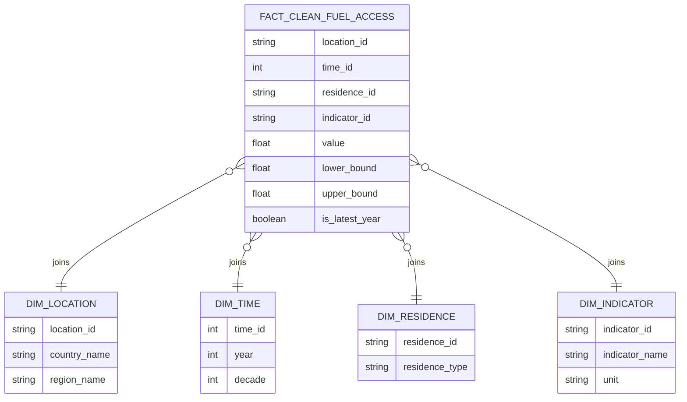

# etl-project-first-delivery

## Libraries
The project uses the following python libraries on its jupyter notebook. Please make sure they are installed by running 
`pip install -r requirements.txt`

* Pandas: dataframe management. the team leaned towards this library due to their experience working with it, as well as simplicity's sake.  
* Duckdb: python + SQL.  
* matplotlib, plotly: simple yet effective tools to visualize the first few outputs of the pipeline at the dashboard level.  

## Technologies 
### Data Warehouse Architecture 
The project uses a relational model for the database, both in raw and in data warehouse variations. Since the latter is OLAP-oriented, the team opted for a star architecture, as it was deemed a better fit for the current needs. Though future expansions are contemplated, the extent to which we, as a team, decided to work on this delivery was deemed suitable for a star model; any subsequent improvements on the warehouse can be worked on top of the current architecture without significant inconveniences or tech debt.  

