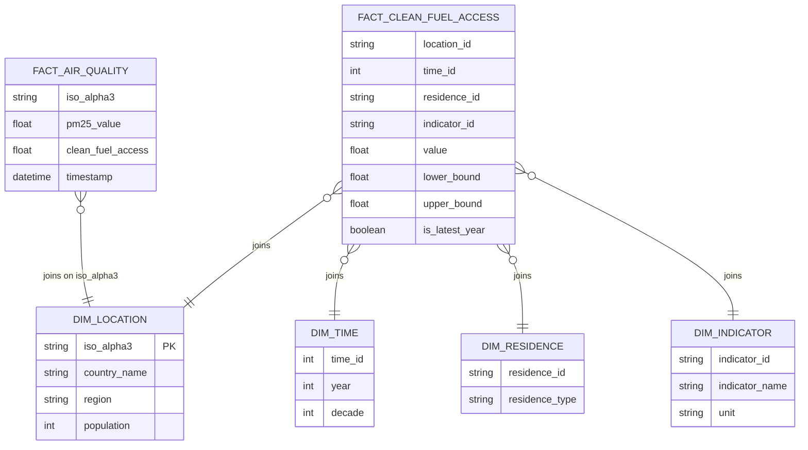
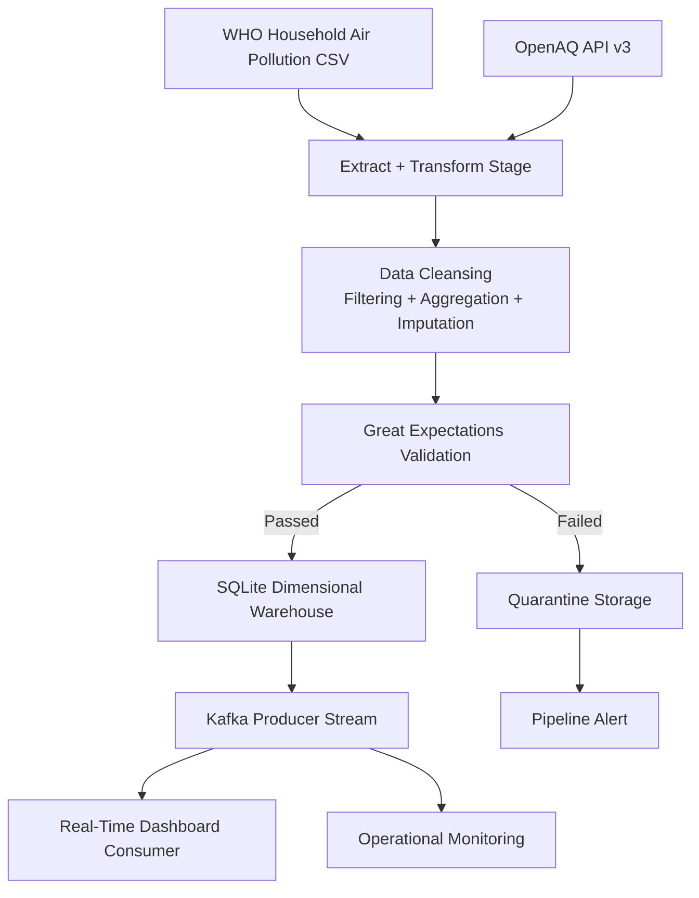

# etl-project-final-delivery
check first delivery link: [tree/main](https://github.com/juandavidmeza-prog/etl-project-first-delivery/tree/main)  
check second delivery link: [tree/second_delivery](https://github.com/juandavidmeza-prog/etl-project-first-delivery/tree/second_delivery)  

### relevant ipynbs
if submission before deadline is paramount: [air_quality_pipeline_final_v1.ipynb](https://github.com/juandavidmeza-prog/etl-project-first-delivery/blob/final_delivery/air_quality_pipeline_final_v1.ipynb)  
if leniency is given for improvements on pipeline (read ### Airflow DAG design for details): [final_delivery_pipeline_v2.ipynb](https://github.com/juandavidmeza-prog/etl-project-first-delivery/blob/final_delivery/ipynb/final_delivery_pipeline_v2.ipynb)  
^or better yet, this collab permalink because preview on github is corrupted, apparently: [final_delivery_pipeline](https://colab.research.google.com/drive/1B6G-KHbdDiioxNiLhBG_FNT-klLbBOBg?usp=sharing)  

### previous EDAs not within this repository (shared to UAO accounts) 
WHO clean fuel access: [household-air-pollution.ipynb](https://colab.research.google.com/drive/1cp1FPLmB3UjSoLDi7RSLjEUf3xGYdQ-p)  
OpenAQ: [openaq-test.ipynb](https://colab.research.google.com/drive/1CVlm32kN8q8N9Viz_RtwlFhEm4xqIWT8)  

## Team Members
$$
\begin{array}{|c|c|}
\hline
\text{Código} & \text{Apellido} & \text{Nombre}\\
\hline
\text {2240129}  & \text {Meza}  & \text {Juan David} \\
\text {2243533}  & \text {Uribe}  & \text {Santiago}  \\
\text {2249266}  & \text {Zambrano}  & \text {Andrés}  \\
\hline
\end{array}
$$

## Libraries
The project was designed to run on the Google Colab environment. While this poses some limitations to the scope and availability of the notebook and its dependencies, the pros outweighted the cons. Namely, the guarantee that it would run under the preset configuration for every team member or evaluator, as well as the comfort of an option that was already tried and tested along the course's activities. 

Even though no dependencies are to be installed locally, the notebook does ask for a few imports. Their names and roles are as presented: 

* Pandas: dataframe management, EDA, plotly, and `.csv` to `.db` intermediary.  
* SQLite3: python + SQL. Replaced DuckDB as per the Airflow setup provided during the course.  
* plotly: most competent way of integrating a dashboard visualization into Google Colab.
* Airflow and Great Expectations: orchestrator and data quality validator for the pipeline, respectively, in accordance to the expected scope of the project. Worth noting, their use and implementation is identical to the `airflow_gx.ipynb` example displayed during class.
* Kafka: streaming data from the warehouse to simulate a pipeline with live updates on an operational process dashboard. Much like Airflow, takes after the notebooks provided by the professor.  
* Requests: handling OpenAQ and REST Countries respective API calls.  
* json: API responses handling commodity, as they are sent in `.json` format, meaning the tailored library is rather suitable.  
* os, datetime, whatever else I'm missing: emotional support.  

## Technologies 
### Data Warehouse Architecture 
Succeeding the first submission, the team focused on expanding the scope of information the warehouse could provide. To this extent, it was decided OpenAQ would fit the job, as it offers valuable, real, and updated insights on the different countries' air conditions (when the API responses work, that is). Given standarized nomenclature is a top priority, the third source that should also guarantee coherence on this regard, and ideally elaborate on the available information for each data point. [REST Countries](https://restcountries.com/) was ultimately chosen for the task, although scrapping [Wikipedia's ISO 3166-1 page](https://en.wikipedia.org/wiki/ISO_3166-1) (or its variants) was considered for the same end.  

Since then, the pipeline has been improved to match the software tools covered along its tertiary and final stage. That is to say, it now includes a Kafka streaming service, orchestrated within Airflow's DAG as part of the ingestion and processing pipeline; this stream is later consumed by an instance from the former library, which allows for a dual plot (both clean fuel access and PM2.5) that contrasts these metrics on a single view refreshing on every update (~1/s).  

A necessary disclaimer is that, because there's much more consistent availability of the clean fuel access metric (100%) when compared to the PM2.5 readings (1000 most recent sensors updated, which might be an unfair sample for those countries with less sensors/lower tickrates), the dashboard will often display entreis with no PM2.5 values; this would, ideally, have been fixed already, were it not for a pressing deadline and a convoluted OpenAQ documentation & endpoints combo.  

Regardless, the team is satisfied with the results of their efforts, and greatly values the experience on working on both ends of the comfort scale for a data ingestion process: one with high refinement value and ready for metrics (WHO's clean fuel access), and the other with a rather crude and unprocessed display that might be inconsistent or present missing values, fairly fitting to a community driven open source project (OpenAQ). RESTCountries is a neglected middle child that will not be acknowledged on this writeup.  

The facts very much remain the same (this time literally, when compared to the second submission).  

### Airflow DAG design
Working on the previous segmnet's foundations, the pipeline works much as the guidelines suggested. The data ingestion and processing remains mostly the same, except for the rewriting of the OpenAQ section: the endpoints missmatch the documentation, and it being orchestrated and delegated to Cloudflare's Airflow instance means it cannot access some of the local data (such as the API key stored on Google Colab secrets tab). That said, the processing and execution is still of the same nature. 

Only other noticeable difference was getting Kafka to run along Airflow —not because they are mutually incompatible, but because their instalation setups result in conflicting package dependencies. While the pipeline works, the Colab environment demands a less-than-pristine cell structure for the aforementioned reasons (and some might need to be ran twice or in an order different to what intuition might suggest). 

Lastly, Great Expectations and its quarantine feature, while useful in theory, has never had any real application during the development phase; it is still convenient as a backup in case this is to be further scaled up, though it should be taken mostly as an excercise on good software practices.    

## Value provided 
While not a thorough or necessary inquiry, the project has still provided an answer that fits its original purpose. Being able to visualize world-wide air quality data aggregated from different sources is a rather inessential commodity, it may still provide some insights for those who actively advocate for taking responsibility over our environmantal conditions; contrasting it with the WHO's measurements allow for a wider scope on which countries are pulling ahead on this task —not as a competition, but as a colelctive effort. Consistently monitorning the nature of the breathing quality across different countries is not ineffectual if the appropriate measures are taken, yet that first demands for the seeds of consiousness to be sown.  

Oh, you meant it as the way the software architecture affects the data processing? ... it has the information decently refined and set to be retrievable on demand at speeds sufficient for this project's scope. Both OLAP and OLTP transactions can be done on the warehouse, each dashboard being an example of it. Surely they can both be improved, but by that point it's better to jump straight to the source providers and look at their own visualizations for their respective datasets.  

### Dashboard (click me)  
tbh i doubt i will update this part. just click the collab permalink and pray it hasn't broken yet. also, there was a prettier graph for the live dashboard, but i had to put it down because it started complicating ipynb compatibility (it also looks ugly as sin when it stops running live but whatever).  

[collab permalink (same as one on top of readme)](https://colab.research.google.com/drive/1B6G-KHbdDiioxNiLhBG_FNT-klLbBOBg)

